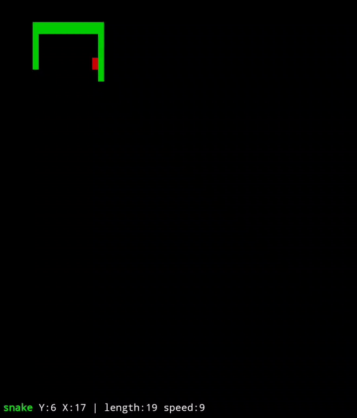

<div align="center">
<h1><code>snake</code></h1>
<p>A super minimal TUI, classic snake implementation written in pure BASH v5.1+</p>

</img>  
<a href="https://discord.gg/W4mQqNnfSq">
</a>

</div>

## Install
stream `snake` without downloading/installing
```bash
bash <(curl -s https://raw.githubusercontent.com/wick3dr0se/snake/main/snake)
```

otherwise, download
```bash
git clone https://github.com/wick3dr0se/snake; cd snake
```

install to $PATH (optional)
```bash
cp snake /usr/local/bin
```

## Usage
if installed to $PATH `snake`, otherwise `./snake` or `bash snake`

## Interface Controls
arrow keys, or:
`H`, `A` - move left
`J`, `S` - move down
`K`, `W` - move up
`L`, `D` - move right

`Q` - quit
any other key pauses

## Terminal Compatibility
Arrow keys are supported via both common escape sequence modes:
- **CSI sequences** (`\e[A`-`\e[D`) — used by xterm, GNOME Terminal, Konsole, iTerm2, most modern terminal emulators
- **SS3 sequences** (`\eOA`-`\eOD`) — used by some VT100-compatible terminals, tmux in certain configurations, and older terminal emulators

Both modes are automatically detected and translated to the equivalent HJKL key, so arrow keys work regardless of which sequence your terminal sends.

### Verifying Your Terminal's Arrow Key Sequences
To check which escape sequences your terminal sends for arrow keys:
```bash
# Method 1: cat -v (press arrow keys, then Ctrl+D to exit)
cat -v
# CSI arrows show as: ^[[A  SS3 arrows show as: ^[OA

# Method 2: showkey -a (if available)
showkey -a
# Displays the decimal/hex codes for each keypress
```

If arrow keys do not work, verify your terminal's `$TERM` variable and keymap settings. WASD and HJKL keys work independently of escape sequences and are always available.

